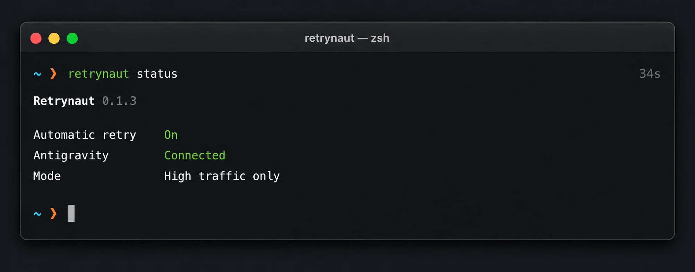

<p align="center">
  
</p>

<h1 align="center">Retrynaut</h1>

Retrynaut is a local background agent that automatically clicks Retry when
Claude runs fail with `high-traffic` errors in the Antigravity 2.x desktop app.

It runs quietly in the background without modifying Antigravity files. Plain
JavaScript, no compiled binaries, no telemetry, no external API calls.

## Install

Requires Node.js 22 or newer.

Install the CLI globally, then start the background agent:

```bash
npm install -g retrynaut
retrynaut install
```

If you'd rather not install globally, use `npx` instead:

```bash
npx -y retrynaut@latest install
```

## How It Works

- Connects to Antigravity's debugging port (`127.0.0.1`) and injects a [small UI watcher](src/retry.js)
- Registers as a native background service so it survives reboots
- Only clicks visible, enabled `Retry` or `Try again` buttons next to a recognized error
- Watches one Antigravity window at a time

## Commands

```bash
retrynaut status              # check whether automatic retry is on
retrynaut start                # turn automatic retry on
retrynaut stop                 # turn automatic retry off
retrynaut uninstall            # remove the background agent and runtime
retrynaut uninstall --purge    # also remove configuration and logs
npm uninstall -g retrynaut     # remove the global CLI
```

## Configuration

When automatic retry is running, configuration changes apply immediately. If it
is stopped, the new settings apply the next time you start it.

```bash
retrynaut doctor                          # test the connection without clicking anything
retrynaut configure --mode all            # all recognized errors
retrynaut configure --mode agent-errors   # only agent-terminated errors
retrynaut configure --max-per-minute 40   # adjust the retry limit
```

## Updating

After updating Node.js or the CLI package, run install again to apply changes:

```bash
npm update -g retrynaut
retrynaut install
```

## Running From Source

No build step or runtime dependencies required:

```bash
git clone https://github.com/ersync/retrynaut.git
cd retrynaut
npm install && npm test
node bin/retrynaut.js doctor
node bin/retrynaut.js install
```
